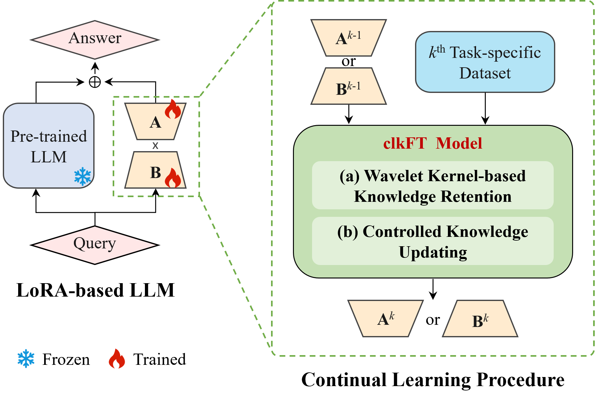

<h1 align="center">DEAL</h1>
<p align="center">
  <b>Data Efficient Adaptation in Large Language Models via Continuous Low-Rank Fine-Tuning</b>
</p>

<p align="center">
  <a href="#"></a>
  <a href="#"></a>
  <a href="#"></a>
  <a href="LICENSE"></a>
</p>

<h3 align="center">✨ Minimal Data → Maximum Retention ✨</h3>

<p align="center">
  <a href="#task-overview"></a>
  <a href="#models-and-usage"></a>
</p>


## 📢 Exciting news  
Our paper has been **accepted by NeurIPS 2025** 🎉🎓  

---

This project provides two main models: **T5** and **LLaMA**, each supporting three types of tasks:  
🚀 **TC** • 📊 **Standard** • ⏳ **Long**

---

## Framework

<p align="center">
  
</p>


## Environment Setup

```bash
pip install -r requirements.txt
```

Please download the t5-large or LLaMA3.1-8B model from Huggingface, place it in the `initial_model/` folder, and rename the folder to `t5-large` or `llama` accordingly.

---

## Task Overview

Our benchmark covers three continual learning scenarios:

### 1. Same-domain Tasks
We use a three-task benchmark consisting of **AG News** (news classification), **DBpedia** (entity typing), and **Yahoo Answers** (question topic prediction). This setup evaluates DEAL's ability to mitigate catastrophic forgetting by retaining transferable knowledge across semantically similar tasks.

### 2. Domain-shift Tasks
To introduce domain variability, we augment the benchmark with **Amazon Reviews** for binary sentiment classification. This domain-shift setting assesses generalization under limited data access and distributional shifts, reflecting practical constraints in real-world continual learning.

### 3. Heterogeneous Multi-task Learning
We evaluate on the 15-task benchmark proposed by Asai et al. (2023), which spans text classification (AG News, DBpedia, Yahoo, Amazon, Yelp), GLUE tasks (MNLI, QQP, RTE, SST-2), SuperGLUE tasks (WiC, CB, COPA, MultiRC, BoolQ), and IMDB. This benchmark tests DEAL's scalability and robustness across heterogeneous tasks and long task sequences.

*All datasets are reformulated into an instruction-following format, with each task limited to 1,000 training and 500 validation examples. For full details on dataset preprocessing, task ordering, and prompt construction, see the Appendix in our paper.*

---

## Models and Usage

### T5 Model

Training and evaluation scripts are in `scripts/`, outputs and logs are in `logs_and_outputs/`.

#### Example Usage

```bash
# TC Task
bash scripts/TC.sh > logs_and_outputs/TC/logs/train_and_infer.log 2>&1 &

# Standard Task
bash scripts/standard.sh > logs_and_outputs/standard/logs/train_and_infer.log 2>&1 &

# Long Task
bash scripts/long.sh > logs_and_outputs/long/logs/train_and_infer.log 2>&1 &
```

---

### LLaMA Model

Training and evaluation scripts are in `scripts_llama/`, outputs and logs are in `logs_and_outputs_llama/`.

#### Example Usage

```bash
# TC Task
bash scripts_llama/TC.sh > logs_and_outputs_llama/TC/logs/train_and_infer.log 2>&1 &

# Standard Task
bash scripts_llama/standard.sh > logs_and_outputs_llama/standard/logs/train_and_infer.log 2>&1 &

# Long Task
bash scripts_llama/long.sh > logs_and_outputs_llama/long/logs/train_and_infer.log 2>&1 &
```

---

## Output Description

- Trained models are saved in the corresponding `logs_and_outputs/` or `logs_and_outputs_llama/outputs/` directories.
- Prediction results for each task are saved in `outputs/TASK_NAME/predict_results.json`.
- Training and inference logs are saved in `logs/train_and_infer.log`.


